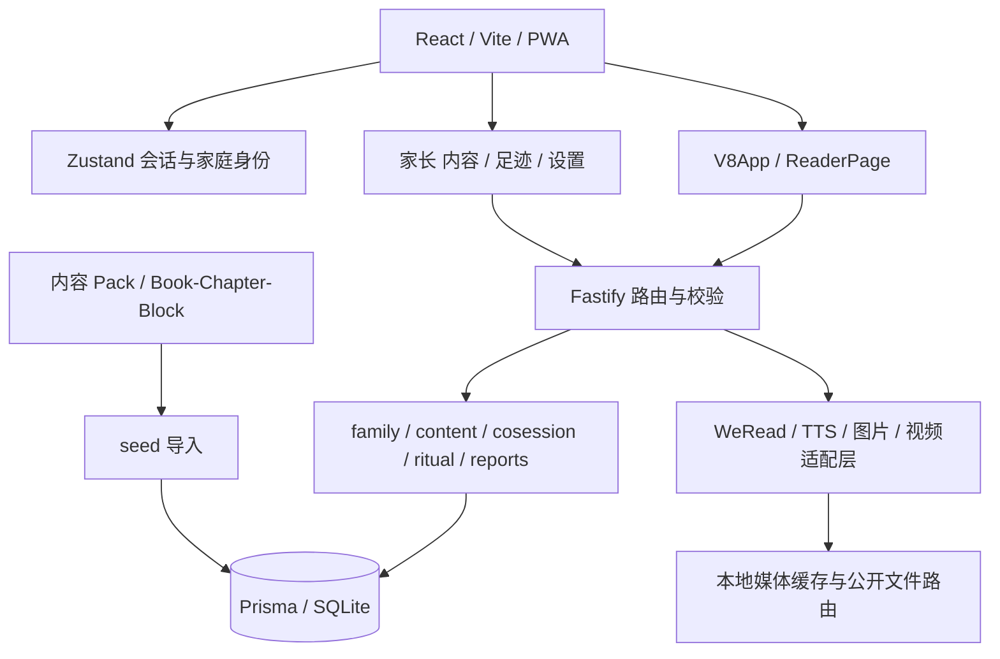

# 桃阅读全面审计报告

日期与基线见 [入口](README.md)。本报告面向实施 agent；所有定位均相对于仓库根目录，行号对应审计基线。证据 B=实际浏览器复现，I=隔离接口复现，S=源码确认，R=设计/运营建议，U=尚待外部或专项验证。P0=对外开放前阻断，P1=核心闭环/上线前，P2=下一迭代，P3=持续优化。优先级是本次风险判断，不代表已发生攻击或生产事故。

## 一、产品定位与当前真实能力

建议定位为“家长可控、儿童自主选择的中英家庭阅读空间”，包括自由阅读、亲子共读、可选的英语基础练习。不要同时把它宣传成全本名著库、专业英语课程、微信读书完整替代品和离线阅读器。

| 能力 | 实际状态 | 必须补齐的闭环 |
|---|---|---|
| 家庭创建、加入、儿童档案 | 已实现 | 家长身份独立证明、撤销设备、恢复路径 |
| 今天推荐、找故事、喜欢、我的 | 当前 V8 主入口 | 真正的最近阅读、筛选组合、空态与错误态 |
| 内置中英正文、章节、拼音、朗读 | 已实现基本路径 | 深链、续读、完成/重读数据、音频可靠性 |
| 生词 | 可收藏、我的可列出 | 上下文、发音、删除、复习；并非词汇教学闭环 |
| 记忆、成就、周报、分享卡 | 有接口和 UI | 数据口径、刷新、日期归一化、隐私分享验收 |
| 家长屏蔽 | 列表生效 | 服务端正文/TTS/会话统一授权 |
| 微信读书 | 网关、绑定、家长书架存在 | 真实接入凭据获取说明、状态反馈、解绑、儿童启动路径 |
| 纸质书 | 后端/旧流程有支持；当前家长内容页为占位 | 明确恢复录入/共读入口，或收缩对外承诺 |
| 休息时间、安静模式 | 有设置及部分实现 | 运行中到点、跨日、减弱动态全路径验证 |
| AI 插画/配音/动画 | 有后端，部分旧组件未接当前路径 | 管理权限、预算、发布审查、来源标识 |
| PWA | 静态资源能力 | 不等于正文和音频离线；明确断网边界 |
| 英语自然拼读 | 尚无完整课程/技能模型 | 见独立 PRD；现有 140 本英文书不等于可解码读物 |

已有优点应保留：后端按家庭、共读、内容、报告、媒体划域；Prisma 约束；大量服务层归属检查；BYOK 加密；微信读书网关的超时/重试/缓存/限流；会话幂等收尾和部分唯一索引；前端错误边界、懒加载及浏览器朗读降级。修复边界优先于技术栈迁移。

## 二、底层架构

当前是 npm workspaces 的模块化单体。`apps/web` 使用 React 18、Vite 5、React Router 6；`apps/server` 使用 Fastify 4、Prisma 5 和 SQLite；`packages/shared` 存共享常量。入口 `apps/server/src/index.ts` 与 `demo/main.ts` 存在启动/种子差异。

目标边界：路由负责校验和身份，应用服务统一执行家庭/儿童/内容可见性策略，内容目录与学习记录分开，媒体生成与发布分开，公共素材与私人文本缓存分开。前端以 AppShell、BookRepository、ReadingSession、AudioSession 分离职责；共享 schema 为前后端唯一契约源。

SQLite 可继续用于单实例、小规模部署；先定义单写入实例、事务、备份恢复与容量上限。只有多实例写入、并发锁等待或容量证据成立时再评估数据库迁移。不要为解决本次缺陷先上微服务、消息中台或重做全部 UI。

## 三、身份、安全与成本边界

### F01 · P0 · 家庭码可直接取得家长身份【I/S】

定位：`apps/server/src/modules/family/service.ts:76` 的 `joinFamily`；`routes.ts` 加入请求；`apps/web/src/stores/session.ts`。服务端直接签入客户端传入的 role。同一个家庭码，提交 parent 即返回 200；儿童端本身保存家庭码。`probe-results.json` 的 AUTH-01 已复现。

影响：家长设置、儿童管理、绑定和注销的角色防线可被绕过；不是“换个按钮文案”能解决。修复：儿童加入码与家长凭据/已授权设备批准分开，服务端决定授予角色；敏感操作需要最近的家长验证。旧家庭迁移不得把已知儿童设备自动提升为家长。验收：持儿童码申请 parent 拒绝；合法家长恢复和新增设备可用；两个家庭互不可管理；速率限制不泄漏有效家庭码。

### F02 · P0 · 屏蔽书籍能绕过列表直接阅读【I/S】

定位：`apps/server/src/content/routes.ts` 详情/章节路由、`content/service.ts` 的 `listBooks/getBook/getChapter`。屏蔽只在列表查询应用，直接读章返回 200（AUTH-02）。

修复：统一 `assertCanAccessContent(familyId, childId, bookId, action)`，覆盖正文、目录、搜索摘要、TTS、会话创建、缓存以及资源派生接口；明确家长管理预览例外。屏蔽后清理儿童本地目录和已缓存正文的可访问状态，避免“立刻隐藏”承诺与事实矛盾。验收：先打开再屏蔽、深链、旧标签页、直接 API、TTS 均按同一策略拒绝；不要只新增 listBooks 测试。

### F03 · P0 · AI 生成角色与全局发布边界缺失【I/S】

定位：`modules/media/artRoutes.ts:40,102,144`、`videoRoutes.ts:40`。使用无 roles 的 requireAuth；儿童请求进入参数校验，返回 400 而非角色拒绝 403（AUTH-03），本次供应商调用为 0。scene 全局共享，生成描述由请求传入。

影响：源码存在儿童触发付费生成及用户输入进入共享素材的路径；本次未实际产生费用，也未证明可覆盖所有已存在缓存。修复：公共书库素材仅平台内容管理员生成并审核发布；家庭定制素材用 family 命名空间且默认私有；角色权限、内容可见性、预算一起校验。验收：儿童及普通家长均不能写公共素材；审核前资源不进入全局书库；失败不留下假成功记录。

### F04 · P1 · 注销后旧令牌仍有效【I/S】

定位：`lib/auth.ts`、`modules/family/routes.ts:33`。令牌约 30 天，requireAuth 仅验证签名/角色。隔离家庭删除后，其原令牌读章节仍 200（AUTH-04）。这不证明已删除私密记录仍能读取。

修复：可撤销设备会话/会话版本，校验家庭与设备有效性，注销与退出所有设备同步失效；设置明确的撤销缓存时效。验收：注销、撤销、角色降级后的令牌被拒绝；正常儿童切换不会误注销整个家庭。

### F05 · P1 · 生成并发、预算与私人音频缓存不足【S】

定位：`modules/media/artRoutes.ts`、`videoRoutes.ts`、`modules/tts/routes.ts`、`cache.ts`。生成流程是查找后生成再 upsert，不能防并发重复计费；TTS 接受自定义文本，不能把所有音频视为公共内容。

修复：按主体及任务内容设幂等键，生成任务状态机、并发额度、每日预算与超额提示；供应商失败可重试但不重复扣内部额度。公共书籍音频与用户任意文本分库/分目录或访问策略；定义 TTL、删除、磁盘上限。验收：并发相同请求仅一个上游任务；取消和断线不无限继续生成；跨家庭不能取得私人音频。哈希文件名不能代替授权。

### F06 · P1 · 反向代理限流配置与实现不一致【S】

定位：`docs/06-部署文档.md`、`apps/server/src/app.ts`、`config.ts`、`lib/ipRateLimit.ts`。文档要求 TAO_TRUST_PROXY，实际未落实到 Fastify trustProxy；限流取 request.ip。

修复：使用可信代理地址/跳数的显式配置，叠加账户/家庭限流，防共享代理出口互相误伤；禁止任意信任伪造转发头。验收：直连伪造 X-Forwarded-For 无效；可信代理下不同客户端能区分；错误配置启动提示清晰。

### F07 · P1 · 生产依赖存在已知漏洞条目【工具结果】

官方 npm audit 返回 4 个依赖条目（2 high、2 moderate、0 critical）：Fastify、find-my-way、react-router、react-router-dom。条目可能共享公告/依赖链，不是 4 次独立可利用攻击。详见原始 JSON。

修复：逐公告判定触发条件、升级兼容性、补锁文件与回归；工具建议跨 Fastify 5/Router 7 大版本，禁止直接 `audit fix --force`。验收：重新生成审计结果，未修项有具体适用性及补偿措施；路由、CORS、错误处理与代理回归通过。

### F08 · P2 · 媒体传输与文件服务需加固【S/U】

定位：`modules/media/routes.ts`。未看到完整 Range/ETag 支持，路径保护采用字符串前缀方式。尚未复现路径穿越，不应写成已证实漏洞。

修复：resolved/realpath 的目录边界、扩展名/MIME 白名单、符号链接策略、Range/条件请求及缓存头；私人媒体授权独立。验收：合法音视频拖动返回正确 206；编码路径/兄弟目录/符号链接测试拒绝越界；大小和错误响应受控。

## 四、阅读、状态与音频

### F09 · P1 · 详情及阅读深链依赖列表内存【B/S】

定位：`V8App.tsx:174,190,758,912`。仅列表路由加载 books，详情和阅读从初始空 context 查找。手机打开唐诗详情后刷新，出现“这本书不在这棵桃树上”，见截图 04/05。

修复：详情/阅读按 ID 独立加载；区分 loading、404、403、断网及服务错误。验收：未访问列表直接打开详情和章节、刷新、后退、过期登录后恢复目的页均正确。

### F10 · P1 · 首页续读未恢复正确章节【S】

定位：`V8App.tsx:239,459,496,610,858`、`ReaderPage.tsx:264`。首页从列表挑书且传 undefined，默认章节 1；详情采用 resumeOrder，行为不统一；阅读器只在 saved chapter 与当前章一致时恢复块。

修复：服务端给出 lastReadAt/游标，统一 ResumeTarget；显式“重读”才回第一章。验收：第 3 章退出，从首页/我的/详情续读都到第 3 章原块；不同孩子分别恢复；完成书重读明确提示。

### F11 · P1 · “好奇”心情无法提交，错误暴露内部枚举【B/S】

定位：`ReaderPage.tsx:38`、`packages/shared/src/index.ts:34`、`modules/cosession/routes.ts:113`。前端 curious 与服务端 sleepy 不一致；截图 08 实际提交失败并出现英文 Zod 细节。改选开心可以结束。

修复：统一共享 schema/DTO；所有可选心情必须可提交；字段校验转成面向家长/儿童的中文提示，技术细节进入脱敏日志。验收：逐心情参数化集成测试；网络失败可重试、不重复成就；返回首页不丢当前选择。

### F12 · P1 · 阅读位置、读完与历史被混为一个状态【I/S】

定位：`content/routes.ts:113`、`content/service.ts:180,239,308`、`modules/reports/service.ts:156`。

已复现：字符串 `"false"` 被 z.coerce.boolean 转成 true；完成后再打开前章把 finished 清成 false；到最后一章即显示 100% 但未完成。周报从当前 finished 判断历史 done，会让重读影响过去统计。

修复：严格 boolean；将当前位置 ReadingCursor、阅读轮次 ReadingRun、不可变完成事件 ReadingCompletion 分开；百分比根据可解释位置计算，未完成不得冒充完成；历史报告以事件时间与事件快照计算。完成上报/会话收尾需事务或幂等一致性设计。验收：字符串参数拒绝；重复提交只一次完成；重读保留历史完成；首章/末章/单章书口径统一；旧数据迁移不凭空产生精确完成时间。

### F13 · P1 · 进度保存静默失败与多设备覆盖【S】

定位：`ReaderPage.tsx:245,378` 及进度节流路径。catch 吞错、5 秒节流会漏快速换章；退出/后台无可靠最后游标提交，缺少版本冲突协议。

修复：单一保存队列、dirty 状态、有限重试、离开提示或待同步标志；pagehide 可 best effort，但不能当可靠提交保证；revision 与冲突策略避免迟到请求覆盖新游标。验收：5 秒内多次换章、断网退出、重连、两设备交错写入均有确定结果。

### F14 · P1 · 报告/记忆刷新与日期口径不统一【S】

定位：`V8App.tsx:206,216`、`modules/ritual/routes.ts:111`、Calendar。完成后未统一失效报告/成就数据；nightLamps 映射 unlockedAt，但 Calendar 使用日期键，应显式归一化日期与家庭时区。

修复：完成事件触发相关 query 失效；API 明确 ISO instant 与 localDate；周/月计算统一。验收：完成后不刷新页面即更新；北京时间午夜及周切换测试；不要通过 UTC 字符串截断替代家庭本地日期规则。

### F15 · P1 · 休息规则与时长统计需明确【S/U】

定位：`ReaderPage.tsx:200`、`modules/cosession/service.ts`、ritual 相关代码。阅读限制主要入场检查，跨到截止时间的动态收尾需验证；时长来自会话墙钟并封顶，不能等同实际专注/学习时长。

修复：前后端统一规则；运行中定时检查，读完当前段后停下；暂停、后台、设备休眠有明确计时口径。验收：临近截止进入、跨午夜、家长修改规则、后台恢复；统计标注“会话时长”或改成有依据的活跃时长，不推断学习效果。

### F16 · P1 · 整章英文 TTS 固定传中文【S】

定位：`modules/tts/routes.ts:175`：`... ? 'zh' : 'zh'`；该请求 body 不接受 lang。普通单段 TTS 与整章行为不同。

修复：从 book.lang 推导语言，校验 voice 能力并提供正确默认；缓存键包含语言、声线、速度、供应商、模型/文本版本。验收：英文整章 mock 上游收到 en；中英缓存隔离；真人听审声音与语言。此次未调用付费服务，不能声称实际英文音质已检验。

### F17 · P1 · 流式音频缺少可靠会话状态机【S】

定位：`apps/web/src/lib/audioPlayer.ts`、`lib/api.ts`、`modules/tts/routes.ts`。Audio ended 回调捕获创建时的 index；等待下一段以 800ms 判终；cancelled 标志跨流复用；无贯通 AbortController。整章包含 note，客户端回退跳过 note，朗读/高亮内容可能不同。

修复：单 AudioSession ID + 当前段状态；区分 waiting/playing/paused/done/error/cancelled；只有 stream done 且队列耗尽才结束；取消透传客户端 fetch 与上游。统一 speakableBlocks。验收：第二段延迟 2 秒仍续播；3 段顺序只播一次；停止后立刻换书旧流不能插入；断线恢复与浏览器回退不会双声播放。

## 五、产品与信息架构

### F18 · P1 · 历史功能存在但当前入口未形成闭环【B/S】

定位：`App`→`ChildHome`→`V8App`→`ReaderPage`；旧 RitualGate/Departure/Finish/ReaderScreen；`parent/ContentHub.tsx:326`。纸质书实际占位，旧睡前流程不能因为文件还在就算当前可用。SceneVideo、wakeLock、readingTheme 在当前 reader 的接入也需明确取舍。

修复：逐项列“保留/恢复/退役”路由决策；先实现纸书最小闭环（标题、孩子、时长/日期、记忆、报告），微信读书从当前儿童入口可到合法外部阅读；删除入口前说明数据保留。验收：从首页真实点击到达，不接受直接渲染旧组件的截图替代。

### F19 · P1 · 微信读书接入说明与状态反馈不完整【S/U】

定位：`parent/BindWizard.tsx`、`modules/family/service.ts`、weread 网关。绑定服务存在 active/unverified，但 UI 未准确区分；解绑缺少可用闭环。UI 所写官方 App 内获取 API Key 的路径尚未用官方资料确认。

修复：先核实到底连接官方能力还是第三方网关，公开说明凭据来源和数据流；未验证显示待验证及重试，不写绑定成功；补解绑及缓存清除。验收：有效/无效/超时/429/解绑分别可见；不要求用户把凭据贴进日志；真实账号验证由获授权操作者完成。

### F20 · P2 · 搜索和筛选不是同一个查询状态【S】

定位：`V8App.tsx:571` 附近。serverHits 提前返回绕过语言/心情过滤，短查询和 URL mood 初值也有分叉；没有响应序号保护。

修复：单一 query model，组合条件一致；Abort/请求序号丢弃过期结果；URL 与界面状态双向同步；加载、空结果、失败分别显示。验收：快速输入不同关键词，组合英文+分类，后退/前进与清空后结果正确。

### F21 · P1 · 年龄标签不等于自主阅读或英语难度【S/R】

222 本书按年龄分 108/81/33 本；大量英文经典标为 3–5，不能自动视为零基础可读。推荐对英语加权，也没有独立熟练度依据。

修复：分开“适合亲子听读年龄”“自主中文阅读”“英语词汇/句法难度”“已学拼读集合”。书卡说明读法与改写性质。新家庭首页主按钮应引导选故事，不能仅提供不可用的继续读。验收：英文零基础孩子不会被承诺可独立解码经典长句；推荐理由有元数据来源。

### F22 · P2 · 生词收藏没有复用闭环【S】

定位：`V8App.tsx:674` 与 words 渲染、`content/service.ts` WordCard、Prisma schema。获取 context 但不显示，缺少发音/删除入口；唯一键按 child+word 未区分语言。

修复：展示原句/来源、点击发音、移除；按语言与规范化词形建键；复习可选且不过度打卡。验收：同形中英词不互相覆盖；删词只影响本孩子；网络失败不是“你还没有生词”。

## 六、UI、UX、UE 与无障碍

保留奶油底、桃子品牌、贴纸边框和亲切表达。优化目标为：儿童第一眼知道可以做什么，阅读时只关注正文，家长能理解数据和控制后果。不要把所有页面换主题来代替修复。

### F23 · P1 · 详情嵌套重复 Shell【B/S】

定位：`V8App.tsx` 的 BookDetail 与外层布局；截图 04。重复 app/wrap/header/main/mobile-nav，产生重复导航及占位。

修复：页面只返回内容，Shell 统一在路由层；阅读页可独立布局。验收：一个主地标、一个当前导航组；手机/平板/桌面无重复页头、固定栏互盖。

### F24 · P1 · 手机隐藏详情核心操作【B/S】

定位：`v8.css:30` 的 max-width:460 与 `.hero-actions .sticker-btn:not(.primary)`。试听/喜欢在小屏被整组隐藏。

修复：次操作折行或明确更多菜单，不用 display:none 削减核心功能；首要继续读保持显著。验收：360/390/460 宽能发现、键盘操作试听与收藏，状态与列表同步。

### F25 · P1 · 阅读器双滚动及底栏横向溢出【B/S】

定位：ReaderPage 内部 100dvh 与外部 V8 Shell；截图 06。390×844 下阅读容器嵌入页面滚动，底部操作需要横滑，完成入口不在首屏工具条可见区。

修复：单一阅读视口、正文单滚动；退出/目录/音频/完成明确优先级，低频设置进面板；safe-area-inset。验收：小屏横竖屏、软键盘、放大字体下都能退出/暂停/完成，滚到文末不被底栏挡。

### F26 · P1 · 实际小目标与视觉层级不适合儿童【B/S】

390×844 详情 DOM 测量：换人约 23×16，底栏项约 110×42，主 CTA 约 73×56。不能用按钮视觉框代替实际 hit area。多处标签 9–11px，卡面书名与插画/喜欢按钮互抢注意。

修复：儿童主要操作建议 56–64px 高，常用触点至少 48×48；这是产品目标，不冒称统一法规阈值。一般正文至少 16px，阅读正文按年龄可调；元数据建议 12–14px 并检查对比；标题移出复杂背景或加稳定底板；嵌套点击卡/收藏避免交互语义冲突。验收：实际盒模型、键盘顺序和 200% 缩放，抽查对比度，不只跑 Tailwind 正则。

### F27 · P1 · 自定义弹层缺少完整无障碍行为【S】

定位：`ReaderPage.tsx:73` Overlay；现有 TaSheet 可复用。缺 dialog/aria-modal、焦点约束、Esc 与可见关闭闭环。

修复：可访问弹层原语、标题关联、焦点归还、背景 inert、滚动锁；动作按钮明确名称。英文正文设置正确 lang；安静模式兼容 prefers-reduced-motion。验收：仅键盘能打开/操作/关闭，读屏只读当前弹层；不因关闭丢掉已保存阅读记录。

### F28 · P2 · 家长端状态、来源与文案泄漏实现细节【B/S】

定位：`parent/ContentHub.tsx` HubCover，`ReportPanel.tsx`，截图 13。微信读书封面也标 AI；周报来源直接显示 voice/weread；“今天还未开始”与读完后的呈现需区分。

修复：来源数据驱动标识，展示“孩子的话/微信读书摘录”；区分未开始/进行中/已完成/同步失败。验收：人工/外部/AI 图标不会混标；所有用户可见状态有中文说明，更新时间与口径可查。

### F29 · P2 · 设计规范与检查器已经漂移【工具/S】

`docs/design-system.md` 旧深色/64px，与 V8 纸色及 56/48/44px 不一致。`audit:touch` 40 个 TSX 报 68 项，检查器只理解部分 Tailwind，不足以判定 68 个真实缺陷。

修复：以实际组件和 computed style 更新 tokens/规范；自动检查行为及目标尺寸，保留人工视检。验收：误报有依据消除，真实换人小目标能被发现；规范、KitchenSink、生产组件同源。

## 七、内容质量、版权与儿童适配

全库机器清点：222 本、2,513 章、7,465 个块；中文 82/英文 140；蒙学 10、古诗 21、故事 45、童话 146。无重复 book ID、无空章、无空文本块。此结论仅限结构，不证明文本正确或完整。

### F30 · P1 · 版权与来源描述不一致【S/B/U】

权利标记为 pd-70 57 本、pd-us 86、adapted 43、original 14、cc-by 22。101 本没有 sourceUrl；原创可能合理缺原文来源，不能据此认定违法。设置却统一称“文本内容为公版书籍原文”。

修复：作者/译者/改写者/插画者、来源版本、授权名称版本与链接、适用地域、变更声明、人工/AI 处理记录分别存储并在书籍版权页呈现。CC 内容需对应署名链；pd-us 不自动等于中国及所有发行地区公版。Milne 等作品须按目标市场审查，不由 agent 自行下法律结论。验收：222 本逐项 rights manifest；来源不明标待审不发布；家长说明与实物一致。

### F31 · P1 · “全本”和文本质量缺乏版本级证明【S/U】

定位：内容 packs、补全/生成脚本、内容完整性检查。以最少章节数达标无法证明全本、原文准确、译文授权、拼音正确。经典短改写版不得只展示原著书名使人误认全本。

修复：明确原文/节选/改写/译写，保留来源版本 hash；编辑逐篇校核拼音多音字、断句、注释、英文语法和低龄适读性。暴力、歧视、恐怖情节及传统价值表达需要语境评审。验收：自动结构检查加编辑签名/日期；抽样不能替代所有计划发布内容的审校完成状态。

### F32 · P1 · 内容重新导入不具备原子性与版本稳定性【S】

定位：`content/seed.ts:62,69,89` 先删章节再批量建章/块。中途失败可能留下半本；章节标识变化影响游标与缓存。

修复：书级事务/版本先入库后原子发布；稳定 contentId/chapterKey/blockKey 与版本迁移表；无变更不改 ID；失败保留上一版本。验收：注入第 N 块失败后旧版本仍可读；重复导入无重复；删除/移动章节时游标可解释迁移；缓存跟随内容版本失效。

## 八、工程、部署、性能与运营

### F33 · P0 · 未声明 sharp 依赖导致干净环境不可复现【工具/S】

`modules/media/compress.ts:8`、`label.ts:14` 静态 import sharp；package.json/lock 无声明。`npm ls sharp --all` 为 sharp@0.35.4 extraneous。本机能启动不能证明部署能启动。

修复：明确必需/可选依赖策略并锁版本，若可选须真正延迟加载与受控降级；从新目录 `npm ci` 进行启动测试。验收：干净安装、Prisma generate/migrate、启动与媒体处理通过，不依赖用户本地额外 node_modules。

### F34 · P1 · 生产启动缺内容初始化操作手册【S/U】

定位：`src/index.ts` 与 `demo/main.ts`、部署文档。生产入口未执行 seedAllPacks/media 导入，文档缺可靠初始化命令；迁移建表不等于书库可用。

修复：显式生产内容 import/validate/release 命令；部署前后检查书库/素材版本；不在每次启动盲删重灌。验收：空数据库按文档从零完成，核心书可读；重复部署保留家庭数据；回滚应用/内容版本均可恢复。

### F35 · P1 · 演示/E2E 可能继承真实供应商配置【S】

demo 使用 loadConfig，要求 master/db，且环境有配置时可注入真实 AI；与“零配置/零网络”承诺不符。E2E 继承环境需隔离。

修复：测试默认禁止外网/付费依赖，全部供应商 fake；随机临时 DB/端口，生成无权限测试密钥；退出仅清自己的资源。验收：即使宿主设有真实 provider env，测试也没有上游请求；不得清掉用户 demo 家庭。

### F36 · P1 · 质量门禁并未全绿【工具】

typecheck 通过；lint 8 错；后端 293/294 通过，seed 幂等用例 60 秒超时；前端 125/125 通过；verify 首先被 touch 检查阻断。没有证据可称“全部测试通过”。仓库未见跟踪的 GitHub Actions 工作流。

修复：先校准检查器与修复 lint；seed 超时做时间/资源分析，不仅调大 timeout；增加隔离 CI：安装、类型、lint、单测、构建、真实路由 E2E、依赖审计。验收：干净 CI 可重复，测试失败会阻断合并；基线与新增回归分开报告。

### F37 · P2 · 前端大组件与领域依赖倒置【S】

V8App 约 929 行、ReaderPage 约 1119 行；parent/ContentHub 从 child/V8App 引 PageHead；V8App/ReaderPage 有耦合，ReaderScreen 因 PoemRuby 仍被引用。

修复顺序：先抽共享 PageHead/PoemRuby、book query 与 session/audio 服务，再拆页面；用真实路由回归保护。不要和 F09–F17 修复同时一次性重构所有文件。验收：父端不导入儿童应用容器；页面不直接控制上游供应商；shared 不承载 UI。

### F38 · P1 · 备份恢复、密钥恢复与数据生命周期缺验收证据【R/U】

SQLite 文件、媒体目录、加密 master key、内容版本必须一致恢复。未执行生产灾备演练，也没有本次证据证明已有可靠恢复。

修复：定义 RPO/RTO、在线一致备份、加密异地存储、定期恢复到隔离实例；设备撤销与家庭删除覆盖学习记录/缓存/备份保留政策；恢复密钥用受控渠道。验收：演练能恢复解密后的绑定能力与阅读记录；日志与备份不泄漏明文凭据；记录恢复耗时。

### F39 · P2 · PWA 静态离线与阅读离线不同【S/U】

当前静态预缓存不保证内容/audio 可离线；自动更新策略有中断会话风险。

修复：先声明仅在线阅读，或显式下载书籍版本/音频，显示容量/过期/删除；阅读中等待安全点更新；私人缓存随退出/删除策略清理。验收：飞行模式进入缓存/未缓存书分别有准确反馈；service worker 升级不中断正文与保存。

### F40 · P2 · 性能、可观测性和容量缺实际基线【R/U】

当前列表和长章节宜测低端 Android、长目录、慢网、图片错误；未做生产负载或 Core Web Vitals 测量，不报告虚构分数。

修复：记录书库响应、章加载、可交互、音频首声、失败率、磁盘、DB 锁等待、供应商成本；请求 ID 串联脱敏错误；按测量再分页/虚拟化/缓存，不先增加架构层。建议试点 SLO：普通正文可用 p95≤2秒、缓存首声≤1秒、冷音频显示进度且可取消；这些是待实测协商目标。验收：明确设备/网络/样本/分位数与回归预算。

### F41 · P1 · 儿童隐私和家长告知需形成数据清单【R/U】

已有 BYOK 加密及分享卡避开家庭码值得保留，但不替代儿童产品完整数据治理。部署地区、真实用户规模、第三方条款本次未核实。

修复：列每字段目的、保存期、供应商传输、可导出/删除范围；家长可查看并管理；避免把孩子昵称/读书句子直接送外部模型；自然拼读 MVP 不收麦克风音频。验收：分享卡不含家庭码/凭据/隐性标识；删除覆盖新增课程数据；第三方传输获得所需告知/授权。合规结论由目标市场专业人员复核。

### F42 · P2 · 文档承诺与当前路由实现不一致【S】

README 的不分发正文、睡前/微信读书导向，与 222 本自带内容、白天 V8 路由不一致；旧迭代“完成”报告不能充当当前验收。

修复：更新唯一架构/启动/功能状态表，旧交付报告保留历史标记；从构建和内容 manifest 自动生成版本信息。验收：新 agent 按当前文档能启动与走完产品，不需要猜哪个旧入口还有效。

### F43 · P2 · 缺少以家庭任务为中心的试点评价【R】

不要只看书本数量、点击率、连胜天数。试点指标：首次成功选书并开始、正确续读、完成保存成功、朗读中断率、家长屏蔽可信度、儿童独立操作成功率、家长对报告理解率；自然拼读另测迁移解码任务。

建议招募覆盖 3–5/6–8/9–12 与不同英语水平的亲子家庭，取得所需同意，做“选书—读—暂停—续读—收尾—家长看记录”观察。样本小只报观察，不声称统计显著或教育疗效。验收：每次试点留任务成功/失败原因，按严重度回填本问题表；无惩罚性连续打卡。

## 九、页面证据索引与界面修复目标

| 证据 | 内容 | 主要结论 |
|---|---|---|
| [01 登录](screenshots/01-login.png) | 手机登录 | 家庭码/角色入口 |
| [02 今天](screenshots/02-child-today.png) / [03 找故事](screenshots/03-discover.png) | 原用户运行实例只读页面 | 品牌保留；推荐/卡片层级改进 |
| [04 详情](screenshots/04-detail-mobile.png) / [05 刷新](screenshots/05-detail-refresh.png) | 同书刷新前后 | Shell 重复与深链失败 |
| [06 阅读](screenshots/06-reader-mobile.png) | 隔离实例英文阅读 | 双滚动/工具条溢出；其中备用封面不是全站媒体缺失证据 |
| [07 收尾](screenshots/07-finish.png) / [08 错误](screenshots/08-finish-curious-error.png) | 好奇提交失败 | 枚举契约不一致 |
| [09 我的](screenshots/09-my-mobile.png) | 隔离实例 | 阅读入口和信息层级 |
| [10 家长今天](screenshots/10-parent-mobile.png) / [11 纸质书](screenshots/11-paper-placeholder.png) | 隔离实例 | 纸质书占位 |
| [12 设置](screenshots/12-settings-mobile.png) / [13 平板周报](screenshots/13-report-tablet.png) / [14 桌面周报](screenshots/14-report-desktop.png) | 隔离实例 | 家长控制、原始来源标签与响应式布局 |

设计交接先画四个低保真状态：新家庭今天、已有进度今天、独立阅读器、完成结果。每个含 loading/empty/error/offline/blocked；确认信息顺序再改样式。页面顶部只保留必要导航，阅读正文与媒体控制不能争夺首屏，家长操作必须有后果说明与结果反馈。优先修 F09–F17 与 F23–F27 后再做视觉精修。
