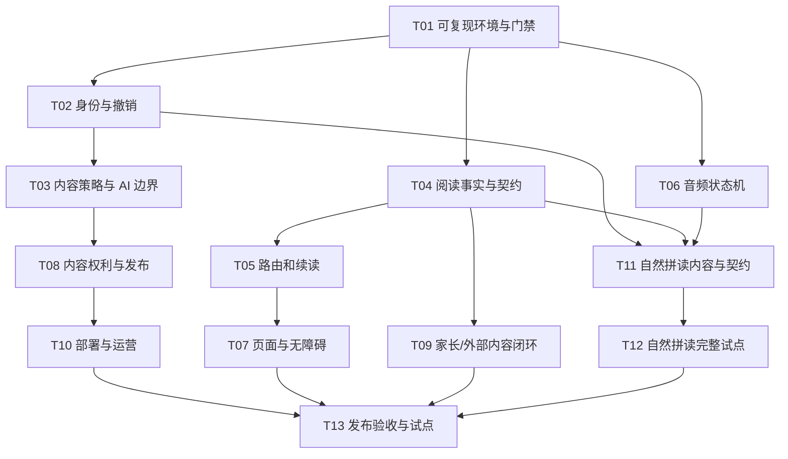

# Agent 执行任务书

配套：[全面审计](01-全面审计报告.md)、[自然拼读 PRD](02-英语自然拼读方案.md)、[验证记录](04-验证与覆盖记录.md)。基线 `47e55c088bd0ac41ad340f239eea5b4aac759e1b`。

## 一、所有执行者必须遵守

1. 先读取当前仓库状态与就近 AGENTS.md；此报告是日期快照，代码前进后先确认缺陷仍存在，不机械套行号。
2. 保留用户未提交内容与正在运行的 5173/8787 实例。当前原有未跟踪 Word 报告不得覆盖。测试使用独立目录、随机 DB 和空闲端口。
3. 一个工作包解决一个一致问题；不得顺手重写技术栈、迁移数据库或删除旧功能。跨包共享 schema/Prisma 迁移必须由一个负责人顺序集成。
4. 优先用 mock 供应商；不调用真实付费 AI、不绑定真实账号、不发送外部消息、不提交/推送/部署，除非用户另有明确授权。
5. 每个缺陷先记录复现，再实现必要修改，再跑对应测试和真实浏览器；提交交付说明时列已通过、原有失败和未验证，禁止写“应该通过”。
6. 需要原始来源/课程教师/真实设备的验收，由明确负责人完成；agent 不能靠生成更多文档把它标为通过。

## 二、依赖与实施阶段



图中可并行只表示后续协调建议，不授权自动创建 agent。多 agent 执行时使用独立 worktree，禁止同时改 V8App/ReaderPage 或同一 Prisma migration。先集成契约，再集成消费方；不要以“各分支测试通过”代替合并后的整体回归。

| 阶段 | 交付目标 | 退出门槛 |
|---|---|---|
| G0 基线 | T01 | 干净安装可启动，真实失败与工具误报分开 |
| G1 可信阅读 | T02–T06 | 身份/屏蔽/计费边界及续读/完成/音频关键用例通过 |
| G2 稳定产品 | T07–T10 | 移动端闭环、内容标识、生产初始化/恢复可演练 |
| G3 拼读试点 | T11–T12 | 8 课内容/音频签审，完整试点家庭可用 |
| G4 发布评估 | T13 | 所有阻断项关闭或明确不发布相应能力，无未解释的高风险 |

## 三、工作包

### T01 · P0 · 干净启动与质量基线

- 对应 F07、F29、F33、F35、F36、F42。
- 范围：root/server/web package manifests 与 lock、测试启动脚本、touch checker、CI 和当前启动文档。不要在本包重构业务。
- 实施：修复 sharp 声明；隔离供应商/DB/端口；解决 8 项 lint；分析 seed 超时；修正 computed CSS 与静态规则差异；逐项处理依赖公告。
- 验收：全新目录 npm ci→Prisma generate/migrate→服务器启动→前端构建；typecheck/lint/单测；核实 CI 真正触发；更新官方 npm audit 结果。不能通过删除测试/忽略整个目录消除失败。
- 回滚：恢复依赖锁和脚本即可；没有业务数据迁移。大版本依赖更新拆独立变更并做框架兼容验收。
- 输出：环境要求、完整命令、测试摘要、未解决公告及原因。

### T02 · P0 · 家长身份、设备会话与撤销

- 对应 F01、F04、F41。依赖 T01。
- 范围：family service/routes、lib/auth、Prisma、session store、LoginPage、家长设置。
- 决策：家长凭据/已授权设备批准采用哪种产品方案；提交设计说明与迁移，不能只加客户端 PIN 弹窗。家长恢复不允许再次凭儿童码提升。
- 测试：儿童码申请 parent、伪造 role、跨家庭 childId、撤销/注销旧令牌、合法新设备、过期凭据、速率限制。
- 迁移：新增会话表/角色授予记录；明确旧 parent token 重新验证策略；双读过渡必须有限期且不可保留升级漏洞。
- 回滚：不能回滚到允许儿童升权的认证版本；异常时暂停家长敏感操作并保留恢复通道。
- 完成定义：UI 和直接 API 都不可绕过，密钥/令牌不出日志，原正常读书流程通过。

### T03 · P0 · 内容授权、AI 发布和费用边界

- 对应 F02、F03、F05、F06、F08。依赖 T02。
- 范围：content policy、正文/搜索/TTS/cosession 路由、媒体任务、文件服务、代理/限流配置。
- 实施：权限矩阵区分儿童、家长、平台管理员；公共生成必须管理员；家庭媒体隔离；所有内容访问复用策略；任务幂等/预算/取消。
- 测试：屏蔽后的直接正文与 TTS；旧标签缓存；跨家庭资源；并发 20 个同一任务上游仅调用一次；任意 scene 不得抢占公共资源；可信/伪造代理头；文件越界与 Range。
- 数据：新增任务/所有者/审核状态，不把现有全局素材批量归属给某个家庭；来源不清先标待审。
- 回滚：关闭生成入口仍能阅读已审核素材；预算服务失败应拒绝新计费任务。
- 完成定义：关闭任何一个 UI 入口都不是唯一防线；权限和计费均服务端强制。

### T04 · P1 · 阅读事实模型与跨端契约

- 对应 F11–F15。可在 T01 后实施，集成需兼容 T02。
- 范围：shared schema、content progress、cosession finish、reports/ritual、Prisma 迁移及 API DTO。
- 实施：严格 boolean；统一心情；分离游标、阅读轮次、完成事件；幂等事务；报告快照口径与家庭时区；并发 revision。
- 测试：所有心情、false 字符串拒绝、最后一章未完成、完成后重读、历史报告不回退、双设备乱序、重复 finish、午夜/周界、离线恢复。
- 迁移：原 finished=true 只可标“历史完成、时间未知/来源迁移”，不得伪造精确日期；保留旧游标；迁移前后对账。
- 回滚：新增表先兼容读取；验证后才去旧字段，至少一个版本可退；数据修复脚本 dry-run。
- 完成定义：产品文案“读到/读过/读完/共读时长”有唯一口径，测试覆盖其差异。

### T05 · P1 · 深链、续读、搜索和保存体验

- 对应 F09、F10、F13、F14、F20、F21。依赖 T04 DTO。
- 范围：V8App、ReaderPage 的查询与导航、book API client、相关 store/hooks。
- 实施：详情独立 fetch；统一 ResumeTarget；最近读按时间；保存队列/待同步提示；数据失效；query model 与 URL 同步；错误不伪装为空。
- 测试：直接深链/刷新/登录后恢复；多孩子第 3 章续读；快换章/断网；快速输入乱序搜索；新家庭空态有选书入口。
- 完成定义：手机真实流程“打开—读—退出—续读—收尾”成功；本包避免全量视觉改造。

### T06 · P1 · 语言正确且可取消的音频

- 对应 F16、F17、F05 的 TTS 部分。依赖 T01；与 T03 协议协调。
- 范围：audioPlayer、api SSE、服务端 TTS routes/client/cache/timeline。
- 实施：英文从 book.lang；voice 兼容性；AudioSession 状态机；流完成与队列完成分离；取消链；统一朗读块；带版本的缓存键。
- 测试：3 段乱延迟、2 秒空档、慢网、切书、停止后重开、供应商 429/超时、浏览器回退无双播、英文 mock 参数；授权后实际听审。
- 回滚：旧缓存只读或失效，不删除全部用户媒体；可关闭云朗读显示明确降级。
- 完成定义：通过 mock 不代表音质通过；交付分别写功能测试和听审状态。

### T07 · P1 · UI/UX/UE 与无障碍收敛

- 对应 F23–F29、F37。依赖 T05 稳定路由；T06 接口。
- 范围：统一 AppShell、PageHead、Reader 专属布局、TaSheet/dialog、v8 tokens、卡片/底栏。
- 实施：移除重复 Shell；保留小屏试听/收藏；读屏单滚动；操作优先级；小目标/字体；焦点和 Esc；lang/reduced-motion；来源标签由数据驱动。
- 验收：360×800、390×844、768×1024、1440×900，至少一种手机真机及键盘/读屏；200% 缩放和 safe-area；所有主操作可达；旧截图与新截图同视口比较。
- 完成定义：不能用 screenshot 好看替代真实点击；不能用 68 个静态 flags 全消失冒充可访问性合规。
- 回滚：CSS/组件按页面渐进切换；不同时改阅读数据模型。

### T08 · P1 · 内容权利、审校与版本化发布

- 对应 F21、F30–F32。依赖 T03 内容发布权限；可先离线清点。
- 范围：CBF types/packs/seed、rights manifest、书籍版权/版本 UI、校验脚本。
- 实施：222 本逐项来源与版本；全本/节选/改写标识；CC 链；地区审查；稳定章块键；书级事务/版本发布。
- 验收：自动检查全库；每本计划发布内容有编辑审校状态；故障注入 seed 不丢旧书；重复导入不改 ID；旧进度迁移。
- 回滚：发布指针退到上一版本，保留历史 manifest；不删除旧版本后再希望用备份补救。
- 完成定义：agent 只整理证据与工具，版权/文本/音频专业审定由明确人员签认；待审内容不能写“已清权”。

### T09 · P1/P2 · 家长功能与外部内容闭环

- 对应 F18、F19、F22、F28、F43。依赖 T02、T04。
- 范围：ContentHub、BindWizard、Tonight/Report/Settings、纸质书录入、生词列表与 API。
- 实施：明确保留旧功能清单；纸质书录入→共读→报告；微信读书真实接入说明与 active/unverified/retry/unbind；词卡上下文/发音/移除；中文来源与状态。
- 验收：绑定失败不可报成功；解绑后清缓存且不影响内置书库；纸书历史与内置书完成口径分开；生词同形异语言不冲突；不真实调用未授权账号。
- 完成定义：每个宣称支持的内容源，都能从当前主入口走完至少一条真实路径。

### T10 · P1/P2 · 可部署、可恢复、可观测

- 对应 F34、F38–F42。依赖 T01、T03、T08。
- 范围：生产启动/内容导入命令、部署文档、健康检查、备份恢复、PWA 更新、指标。
- 实施：新库初始化；readiness 区分数据库与可选供应商；请求 ID/脱敏；磁盘/预算告警；一致备份与加密 key 管理；明确离线范围。
- 验收：空环境按文档启动；隔离恢复演练；优雅关停；慢网与缓存基线；PWA 更新不中断阅读；家庭删除覆盖数据清单。
- 完成定义：记录实测 RPO/RTO/响应分位数；不可用承诺未实现时收缩文案。负载测试只能对授权环境。

### T11 · P1 · 自然拼读内容与契约先行

- 对应 02 全文；依赖 T02、T04、T06，T08 内容规范。
- 范围：课程 schema、音频 manifest、8 课 draft、自动验证器、接口 OpenAPI/共享 DTO、教师审校表。
- 实施：锁口音、GPC 顺序、词/字素对齐、例外词、音频版本与权利；分清尝试与能力证据；设计迁移与删除。
- 验收：未学 GPC 的词自动拦截（如未教 c 的 cat）；例外不能被静默放行；缺听审/权利状态阻止发布；课程图无环；音频每条核查。
- 完成定义：交付可审校内容，不把未经教师批准的 AI 草稿作为正式课程。

### T12 · P1 · 自然拼读一个完整纵向试点

- 依赖 T11，且现有安全/阅读阻断项关闭。
- 范围：phonics 模块、授权/attempt/response/summary API、专注练习页、家长开启/记录。
- 实施顺序：一课从开启到复习完整实现→角色/幂等/音频测试→接 8 课；默认 feature flag 关闭；不添加录音/ASR。
- 验收：两个家庭两个孩子隔离；提示作答与独立作答分开；重复请求不增次数；中断可继续；题目未泄露答案；手机操作/听审通过；版本撤回处理。
- 回滚：关闭功能 flag、保留历史数据与课程版本；不得删除其他阅读记录。
- 完成定义：试点记录真实可用性与迁移观察；不对外宣称学习效果显著。

### T13 · P1 · 合并后回归与发布决策

- 覆盖 F01–F43，依赖前述实际计划发布范围。
- 测试矩阵：儿童新家庭/已有家庭/多孩子；家长与儿童权限；中文/英文/纸书/WeRead；首读/续读/重读；离线/超时/401/403；手机/平板/桌面；键盘/动态偏好；课程开启/关闭。
- 流程：干净安装→迁移→内容导入→完整自动验证→真实浏览器与手机→恢复演练→内容/课程审批状态→形成发布报告。
- 完成定义：每个 Fxx 记录 fixed/accepted/deferred/not-reproduced，并附证据；accepted 需要负责人和依据，P0 不能无解释转 deferred 后声称可发布；未上线能力从对外入口/承诺移除。

## 四、可直接复制的 agent 指令

```text
请在 D:\codesolo\taoread 执行审计工作包 Txx。
先读 docs/audit-2026-09-22/README.md、03-Agent执行任务书.md，
再读 01 中对应 Fxx；涉及自然拼读再读 02。
核对当前 HEAD 与工作区，保留所有用户变更。先确认缺陷，再做最小一致修复。
不要修改工作包外功能，不提交/推送/部署，不调用真实付费服务。
使用独立数据库与空闲端口，不停用户现有服务器。
实现后完成工作包测试与相关真实浏览器验收；失败由本次引入则修复。
交付修改文件、行为变化、迁移/回滚说明、实际测试结果及未验证项。
如果报告已过时，给出当前源码/复现证据，不强行按旧行号修改。
```

## 五、每包交付模板

```text
工作包 / 对应发现：
当前基线 / 实际修改路径：
复现前结果：
最终行为与实现边界：
迁移与旧数据处理：
运行的命令、通过/失败数量：
浏览器场景、视口、截图路径：
未验证项及原因：
回滚步骤与残余风险：
是否提交/部署：未授权则没有。
```

建议协调者维护问题状态 CSV/issue 看板，但不要在未授权时自动向 GitHub 创建或发布问题。本任务已经给出本地可执行交接材料，无需把所有改进塞入单个大 PR。
